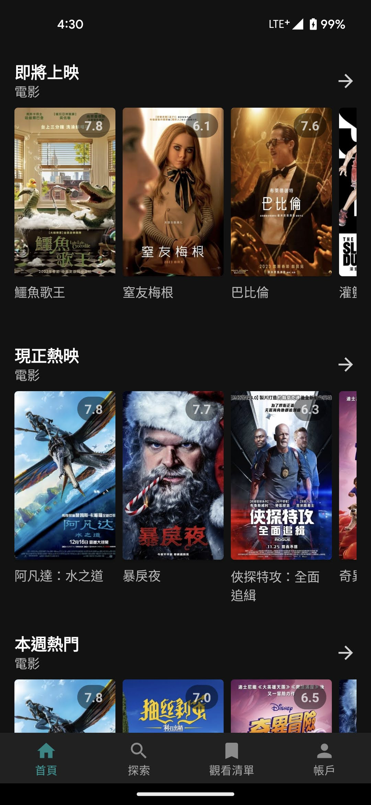
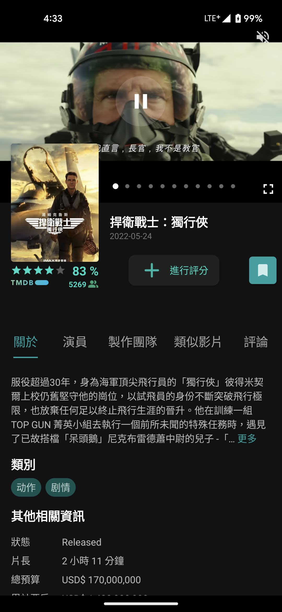
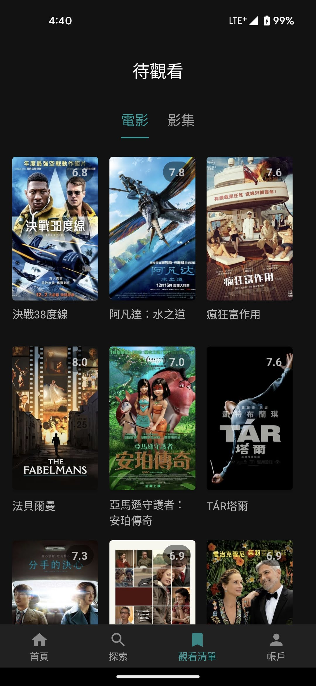
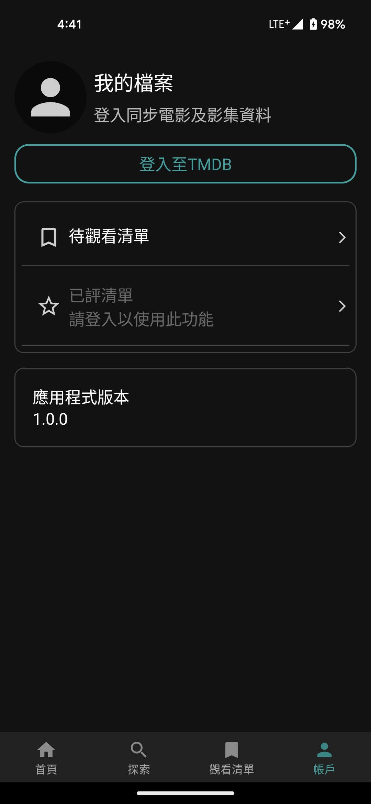

# 宅影視Nerdia Android app

## 簡介
-   探索、追蹤各種影視內容
-   管理個人影視觀看清單
-   於TMDB上評分各影視內容
-   可同步TMDB帳戶內容
-   使用MVVM架構開發

**注意：此App非觀看影視用途**

## ScreenShots
|  |  |  |  |
| ---------------------------------------------- | -------------------------------------------- | ------------------------------------------- | ------------------------------------------- |

## Play商店連結

